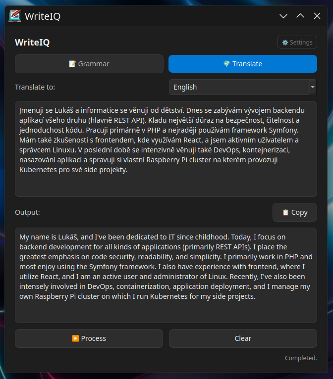

# WriteIQ
**WriteIQ** is a desktop app built with **Python + PyQt6**, powered by **Gemini**.  
It helps you instantly **fix grammar** or **translate text** — directly from your desktop.  
No browser, no login.

## Preview


## Features
- **Grammar mode** – Automatically corrects grammar in any language  
- **Translate mode** – Translates text between languages  
- **Modern dark UI** – Minimalist smooth feel design  
- **Configurable Gemini models** – Pick between 2.5 Flash (speed), 2.5 Pro (balanced) a 1.5 Pro (quality)  

## Installation
### Clone the repository
```bash
git clone https://github.com/lukasbecvar/write-iq.git
cd write-iq
```

### Install dependencies
```bash
pip install -r requirements.txt
```

### Run the app
```bash
python main.py
```

### Shortcut
You can create a desktop shortcut or alias to run the script.
```text
alias write-iq="python /path/to/write-iq/main.py"

[Desktop Entry]
Name=Text Assistant
Exec=/usr/bin/python3 /path/to/write-iq/main.py
Categories=Utility;
Type=Application
Terminal=false
```

On the first launch app will ask for your **Gemini API key**.  
It will automatically validate and store it here:
```
~/.config/write-iq/config.json
```

Application logs are written to:
```
~/.config/write-iq/write-iq.log
```

## Get Your Gemini API Key
1. Go to [Google AI Studio](https://aistudio.google.com/app/apikey)  
2. Generate new API key (format `AIzaSy...`)  
3. Paste it into the app when prompted  

To change your key later, click the **🔑 Key Config**.

## License
This software is licensed under the [MIT license](LICENSE). 
